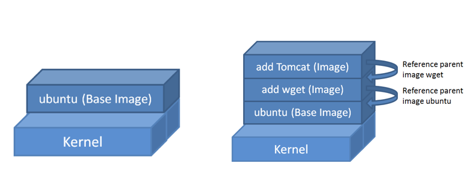

# Segona sessió

- [Persistència de les dades](#persistència-de-les-dades)
- [Entorns de desenvolupament](#entorns-de-desenvolupament)
- [Creació d'imatges](#creació-imatges)

## Persistència de les dades

El cicle de vida que té un contenidor és el següent:


Les modificacions que pateix el contingut del contenidor es mantenen mentre el contenidor existeix. Quan el contenidor és eliminat, aquestes modificacions es perden.

Habitualment els contenidors són **efímers** `docker run --rm`, és a dir, que no es mantenen en el temps. Això és una de les característiques principals de Docker. Però en molts casos necessitem que les dades que es generen dins del contenidor es mantinguin en el temps. Per obtenir aquesta persistència, Docker ens ofereix uns artefactes anomenats **volums**.

## Volums

Els volums són eines que permeten compartir dades entre el contenidor i l'equip host. Això permet que les dades que es generen en el contenidor es puguin mantenir en l'equip host, per exemple, si tenim un contenidor amb una base de dades, podem mantenir les dades en l'equip host, per tant, si el contenidor s'atura o s'elimina, les dades es mantenen. L'ús dels volums per tant, desacobla les dades del contenidor i permet que aquest sigui efímer.

El volum es vincula com un enllaç, això vol dir, que si la ruta destí indicada no existeix, aquesta es crearà dins el contenidor. Si la carpeta ja existeix, es sobreescriurà amb el contingut del volum.

### Tipus de volums

Els volums es poden crear de diferents maneres:

- **Volums anònims**: són volums que es creen automàticament quan s'executa un contenidor i que no tenen cap nom. Aquests volums es creen en el *runtime*.
- **Volums nombrats**: són volums que es creen amb un nom i que es poden utilitzar per compartir dades entre contenidors o per mantenir les dades en l'equip host.
- **Volums de tipus bind**: són volums que es creen a partir d'una carpeta de l'equip host i que es poden utilitzar per compartir dades entre contenidors o per mantenir les dades en l'equip host. Són ideals a la fase de desenvolupament, perquè em permeten utilitzar el meu entorn de treball per desenvolupar i el contenidor per executar l'aplicació.
- **Volums de tipus tmpfs**: són volums que es creen en memòria, per tant, en eliminar el contenidor, s'eliminen les dades.

### Volums anònims

Els volums anònims es creen en el moment de crear el contenidor. Per crear un volum anònim, tradicionalment s'utilitzava la opció `-v`:

```powershell
docker run -d -p 8080:80 -v /usr/share/nginx/html nginx
```

Tot i que aquesta opció encara és vàlida, Docker recomana utilitzar la opció `--mount`:

```powershell
docker run -d -p 8080:80 --mount type=volume,target=/usr/share/nginx/html nginx
```

Estem creant un volum anònim. Aquest volum es crea automàticament i no té cap nom, però s'identifica amb un VOLUME ID, que serà un hash.

```powershell
docker volume ls
DRIVER    VOLUME NAME
local    5e535a490d64e574d2a6bbaf49e6c855104dfeefb565755bdfc1e85d1f830f89
```

### Volums amb nom

Els volums amb nom, es poden crear prèviament i després connectar-los al contenidor o, a l'igual que l'anònim en el moment de crear el contenidor. L'única diferència respecte els anònims és que els assignem un nom, això és molt còmode a l'hora de compartir un volum amb més d'un contenidor.

Aquests volums es poden crear prèviament al *runtime* o durant ell. El seu principal avantatge, és que al tenir nom, es poden compartir entre més d'un contenidor de forma senzilla.

```powershell
docker volume create webdata
docker run -d -p 8080:80 --mount type=volume,target=/usr/share/nginx/html,source=webdata nginx
```

Si no fem la comanda `docker volume create`, el volum es crearà automàticament.

Per compartir el volum en més d'un contenidor, només cal que el connectem al segon contenidor amb la opció `--mount`:

```powershell
docker run -d -p 8081:80 --mount type=volume,target=/usr/share/nginx/html,source=webdata nginx
```

Una opció és connectar directament tots els volums d'un contenidor a un altre, en aquest cas, cal tenir clar, que es connectaran als mateixos punts de muntatge.

```powershell
docker run -d -p 8081:80 --volumes-from webdata nginx
```

### Accions sobre els volums

Els volums es poden llistar amb la comanda `volume ls`:

```powershell
docker volume ls
DRIVER    VOLUME NAME
local     5e535a490d64e574d2a6bbaf49e6c855104dfeefb565755bdfc1e85d1f830f89
local     webdata
```

Els volums es poden eliminar amb la comanda `volume rm`:

```powershell
docker volume rm webdata
webdata
```

Per eliminar tots els volums que no estiguin en ús, podem utilitzar la comanda `volume prune`:

```powershell
docker volume prune
WARNING! This will remove all local volumes not used by at least one container.
Are you sure you want to continue? [y/N] y
Deleted Volumes:
5e535a490d64e574d2a6bbaf49e6c855104dfeefb565755bdfc1e85d1f830f89
webdata
```

Un volum no es pot eliminar mentre tingui un contenidor associat, per tant, si volem eliminar un volum, cal que primer eliminem els contenidors.

### Volums de tipus bind

Els volums de tipus bind, són volums que es creen a partir d'una carpeta de l'equip host. Per tant, són molt útils per connectar per exemple el nostre repositori local de l'aplicació amb el servidor web. Això ens permetrà provar l'aplicació en el mateix entorn que es trobarà en producció.

Un aspecte molt important a tenir en compte és que a source o src per abreujar, cal indicar la **ruta absoluta**. Com això sol ser incòmode, utilitzarem la variable d'entorn `PWD` que ens indica la ruta absoluta de la carpeta on estem treballant.

```powershell
docker run -d -p 8080:80 --mount type=bind,target=/usr/share/nginx/html,source=${PWD} nginx
```

Una cosa a tenir en compte, és que si usem l'opció `mount` la destinació ha d'existir, sinó al crear el contenidor, ens donarà un error. En canvi, si utilitzem l'opció `volume`, la destinació es crearà automàticament.

### Volums de tipus tmpfs

Els volums de tipus tmpfs, són volums que es creen en memòria. Això vol dir que quan eliminem el contenidor, s'eliminen les dades. Aquest tipus de volums són molt útils per a dades temporals, com per exemple, per guardar els logs.

```powershell
docker run -d -p 8080:80 --mount type=tmpfs,target=/usr/share/nginx/html nginx
```

## Entorns de desenvolupament

Docker ens facilita molt disposar d'un entorn de desenvolupament que sigui el més semblant possible a l'entorn de producció. Això ens permetrà provar l'aplicació en un entorn controlat i aïllat, i ens permetrà detectar problemes abans de desplegar l'aplicació en producció.

### Treballant amb un SGBD

Un dels casos més habituals és treballar amb un SGBD. En aquest cas, el que farem serà crear un contenidor amb el SGBD que necessitem, i mitjançant un volum, proporcionar persistència.

#### Exemple: mySQL

En un primer exemple, treballarem amb mySQL. En aquest cas, el contenidor es crea a partir d'una imatge de mySQL que es troba al repositori de DockerHub. Aquesta imatge es descarrega i s'executa amb la comanda:

```bash
docker volume create mysql-db-data
docker run --rm -d -p 3306:3306 --name mysql-db  -e MYSQL_ROOT_PASSWORD=secret --mount src=mysql-db-data,dst=/var/lib/mysql mysql
```

El volum mysql-db-data es crea per tal de guardar les dades de la base de dades. Aquest volum es munta al contenidor de mySQL. Això permet que les dades de la base de dades es mantinguin encara que el contenidor es destrueixi.

Per connectar-se a la base de dades podeu eines com [MySQL WorkBench](https://www.mysql.com/products/workbench/) o extensions de VSCode com [MySQL](https://marketplace.visualstudio.com/items?itemName=formulahendry.vscode-mysql).

Amb l'extensió MySQL dona un error si intenteu contactar amb l'usuari `root`. La solució és crear un usuari nou i connectar-se amb aquest usuari. Per crear un usuari, caldrà en primer lloc, haurem d'entrar dins el contenidor de mySQL:

```bash
docker exec -it mysql_db bash
```

Un cop dins el contenidor, crearem un usuari nou:

```bash
mysql -u root -p
```

```sql
CREATE USER 'user'@'%' IDENTIFIED WITH mysql_native_password BY 'secret';
GRANT ALL PRIVILEGES ON *.* TO 'user'@'%';
FLUSH PRIVILEGES;
```

I ara quan us es crea la connexió usarem l'usuari `user` en comptes de `root`.

#### Exemple: SQL Server

Crearem un contenidor de SQL Server.

```language-bash
docker run --rm -d --name sql1 -e 'ACCEPT_EULA=Y' -e 'SA_PASSWORD=P@ssw0rd2022' -p 1433:1433 -v datavolum:/var/opt/ mcr.microsoft.com/mssql/server
```

Connectem amb Azure Data Studio o usant l'extensió de SQL Server de VSCode.

Crearem una base de dades, copiar el següent codi com una query:

```language-sql
/* Create database */
CREATE DATABASE Music;
GO

/* Change to the Music database */
USE Music;
GO

/* Create tables */
CREATE TABLE Artists (
    ArtistId int IDENTITY(1,1) NOT NULL PRIMARY KEY,
    ArtistName nvarchar(255) NOT NULL,
    ActiveFrom DATE NULL
);

GO
```

Aturem el contenidor (automàticament s'elimina). Si tornem a executar el contenidor la base de dades persisteix.

### Entorns a Contenidors i VS Code Remote Development

Aquesta combinació ens permet aixecar un contenidor per desenvolupar: editar, compilar, executar i depurar el nostre codi en un entorn aïllat. Això ens permetrà tenir un entorn de desenvolupament que sigui el més semblant possible a l'entorn de producció.

Per utilitzar aquesta opció, caldrà tenir instal·lat l'extensió de VS Code [Remote Development](https://marketplace.visualstudio.com/items?itemName=ms-vscode-remote.vscode-remote-extensionpack).

Un cop instal·lada l'extensió, caldrà obrir la paleta de comandes i buscar l'opció `Remote-Containers: Open Folder in Container`. Aquesta opció ens permetrà obrir la carpeta del nostre projecte en un contenidor.

## Creació imatges

Al final, necessitarem crear les nostres pròpies imatges, bé per disposar d'una configuració concreta, o com serà molt més habitual, per empaquetar les nostres aplicacions.

### Creació d'imatges. Arxiu Dockerfile

Per crear una imatge que contingui l'aplicació web, necessitarem un arxiu de configuració anomenat `Dockerfile`. Aquest arxiu conté les instruccions per crear una imatge a partir d'una altra imatge base. Aquesta imatge base pot ser una imatge oficial de Docker Hub o una imatge que haguem creat nosaltres mateixos anteriorment.

Aquestes imatges base es descarregaran del registre de Docker Hub, si no les tenim ja descarregades al nostre sistema, o bé de registres alternatius com GitHub Container Registry.

### Model capes imatges

Les imatges de Docker no són arxius monolítics, sinó que es defineixen per capes. Això permet que les imatges siguin molt lleugeres i que es puguin reutilitzar. A més, aquestes capes es poden compartir entre imatges, per tant, si tenim dues imatges que comparteixen capes, aquestes capes només s'emmagatzemaran una vegada.



Ho podeu observar, perquè quan baixeu una imatge, s'observa com es van descarreguen les succesives capes:

```powershell
docker pull ubuntu
Using default tag: latest
latest: Pulling from library/ubuntu
Digest: sha256:7a47ccc3bbe8a451b500d2b53104868b4f3bf9cd6bceca9d09d6baf9edf58445
Status: Image is up to date for ubuntu:latest
docker.io/library/ubuntu:latest
```

Anem a veure un exemple molt bàsic d'un arxiu `Dockerfile`:

```Dockerfile
#FROM és la imatge base que utilitzem per crear la nostra imatge
FROM nginx:latest
#LABEL per indicar el nom de l'autor de la imatge
LABEL author= "Carlos Alonso Martinez" 
LABEL email ="carlos.martinez@mataro.epiaedu.cat"
# WORKDIR és el directori de treball on es copiaran els fitxers de l'aplicació
WORKDIR /usr/share/nginx/html
# Copy copia tots els fitxers de l'aplicació (carpeta /html) a la imatge a dins el workdir
COPY html/ .
# EXPOSE indica el port que s'ha d'exposar
EXPOSE 80
```

En aquest exemple, estem creant una imatge a partir de la imatge oficial de Nginx. Aquesta imatge conté el servidor web Nginx i el que fem és afegir-li els fitxers de l'aplicació web que volem desplegar. Aquesta aplicació web està dins la carpeta `html` del nostre sistema de fitxers.

### Arxiu Dockerfile. Instruccions

Les instruccions que podem trobar en un arxiu `Dockerfile` són les següents:

- `FROM`: indica la imatge base que utilitzarem per crear la nostra imatge.
- `LABEL`: permet afegir metadades a la imatge, per indicar el nom de l'autor, la versió, etc.
- `ENV`: defineix una variable d'entorn.
- `WORKDIR`: indica el directori de treball on es copiaran els fitxers de l'aplicació.
- `COPY`: copia tots els fitxers de l'aplicació (carpeta /html) a la imatge a dins el workdir.
- `ADD`: similar a COPY, però permet copiar fitxers remots i també permet descomprimir fitxers.
- `RUN`: executa una comanda en el moment de la creació de la imatge. Cada RUN crea una capa nova a la imatge.
- `CMD`: executa una comanda quan es crea un contenidor a partir de la imatge. Només pot haver-hi una instrucció CMD per arxiu Dockerfile. És la comanda que s'executarà per defecte quan es creï un contenidor a partir de la imatge i es pot sobreescriure amb la comanda que es passi com a paràmetre a `docker run`.
- `ENTRYPOINT`: executa una comanda quan es crea un contenidor a partir de la imatge. Només pot haver-hi una instrucció ENTRYPOINT per arxiu Dockerfile. És la comanda que s'executarà per defecte quan es creï un contenidor a partir de la imatge i no es pot sobreescriure amb la comanda que es passi com a paràmetre a `docker run`.
- `USER`: indica l'usuari que s'ha d'utilitzar per executar les comandes que es trobin a continuació.
- `VOLUME`: indica un directori que es vol compartir amb altres contenidors.
- `EXPOSE`: indica el port que s'ha d'exposar. Aquests ports són els que es poden mapejar amb la comanda `docker run -P`.

### .dockerignore

Aquest arxiu ens permet indicar quins arxius o carpetes no volem que es copiïn a la imatge. Això és útil perquè ens permet reduir el tamany de la imatge i millorar la seguretat.

Per exemple, si tenim un arxiu `.git` a la carpeta de l'aplicació, no volem que aquest arxiu es copiï a la imatge, per tant, caldrà afegir aquest arxiu a l'arxiu `.dockerignore`.

### Creació d'imatges. Comandes

Per crear una imatge a partir d'un arxiu `Dockerfile`, caldrà executar la comanda `docker build`. Aquesta comanda té la següent sintaxi:

```bash
docker build -t nom_imatge:tag ruta_arxiu_dockerfile
```

Si per exemple volem crear una imatge a partir de l'arxiu `Dockerfile` que hem vist abans, i volem que aquesta imatge es digui `webapp` i tingui la versió `1.0`, caldrà executar la següent comanda:

```bash
docker build -t webapp:1.0 .
```

Aquesta comanda crearà una imatge a partir de l'arxiu `Dockerfile` que es troba al directori actual. Si l'arxiu `Dockerfile` es troba en un altre directori, caldrà indicar la ruta correcta.


### Creació a partir d'un contenidor

També es pot crear una imatge a partir d'un contenidor. Això és útil per exemple, si hem modificat un contenidor i volem guardar aquesta modificació en una imatge. Per fer això, caldrà executar la comanda `docker commit`. Aquesta comanda té la següent sintaxi:

```bash
docker commit id_contenidor nom_imatge:tag
```

### Registre de la imatge

Si es vol que la imatge es pugui enviar a un registre de Docker Hub o a un altre registre, caldrà que la imatge es digui `nom_usuari/nom_imatge:tag`.

El registre per defecte és Docker Hub i és el que si no s'indica explícitament, s'agafa com a registre per defecte.

Si volem enviar la imatge, per exemple, al registre de GitHub Container Registry, caldrà que la imatge es digui `ghcr.io/nom_usuari/nom_imatge:tag`. En aquest cas, caldrà habilitar un token específic a GitHub per poder enviar la imatge.

La comanda per enviar la imatge a un registre és `docker push`. Per exemple:

```bash
docker push webapp:1.0
```

També podem enviar la imatge des de Docker Desktop, fent clic a la imatge i seleccionant `Push`.

Una tercera opció, és utilitzar Visual Studio Code, que ens permet enviar la imatge a un registre amb un sol clic.

### Imatges multiplataforma

Les imatges de Docker es poden crear per a diferents arquitectures. Això és molt útil perquè ens permet crear imatges que es puguin executar en diferents arquitectures, com per exemple, en arquitectures ARM o en arquitectures x86.

Per crear imatges multiplataforma, caldrà tenir instal·lat el plugin `buildx`. Aquest plugin permet crear imatges per a diferents arquitectures i també permet crear imatges per a diferents plataformes.

Per configurar `buildx`, caldrà executar les següents comandes:

```bash
docker buildx create --name mbuilder
docker buildx use mbuilder
docker buildx inspect --bootstrap
```

Abans de construir la imatge ens hem de loguejar a Docker Hub, perquè la imatge multiplataforma no s'emmagatzema en local, sinó que cal pujar-la al repositori.

```bash
    docker login -u calonso6
```

Un cop configurat `buildx`, ja es pot crear una imatge per a diferents arquitectures. Per exemple, per crear una imatge per a arquitectures ARM i x86, caldrà executar la següent comanda:

I ara ja podem crear una imatge capaç d'executar-se a la arquitectura `linux/amd64` i `linux/arm64`:

```bash
    docker buildx build --platform linux/amd64,linux/arm64 -t calonso6/2048:latest --push .
```

Amb aquesta ordre es construeix la imatge multiplataforma i es puja a Docker Hub.

Com a novetat, les darreres actualitzacions de Docker incloen la possibilitat d'usar `containerd` com a motor d'execució. Aquesta opció permetrà que les imatges multiplataforma es puguin executar en qualsevol arquitectura, independentment de la que s'hagi utilitzat per crear la imatge.

### Etiquetat: versionatge i latest

Si no s'indica cap etiqueta, Docker *etiqueta* la versió com *latest* i òbviamenet, només ens deixarà tenir una imatge associada al nom. Per etiquetar una imatge, farem servir la comanda `docker tag`:

```language-bash
docker tag calonso6/2048 calonso6/2048:v1.0
```

Amb això tindrem la mateixa imatge etiquetada amb `latest` i amb `v1.0`. Si ara volem pujar la imatge amb totes les etiquetes:

```language-bash
docker push -a calonso6/2048
```

L'ús d'etiquetes no només ens permet descriure d'una forma més clara la versió concreta de la imatge, sinó que a més podrem tenir diferents versions de la imatge al repositori.

### Imatges multietapa (multistage)

Les imatges multietapa ens permeten crear imatges que continguin només el necessari per executar l'aplicació. Això ens permetrà reduir el tamany de la imatge i millorar la seguretat.

Aquesta tècnica és molt útil per a aplicacions que es compilen, com per exemple, aplicacions Java, Go, etc.

A l'exemple que veurem a continuació, crearem una imatge que contindrà una aplicació Java.

[Tornar a l'índex](README.md)
