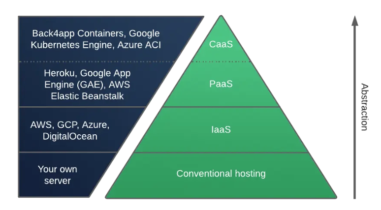
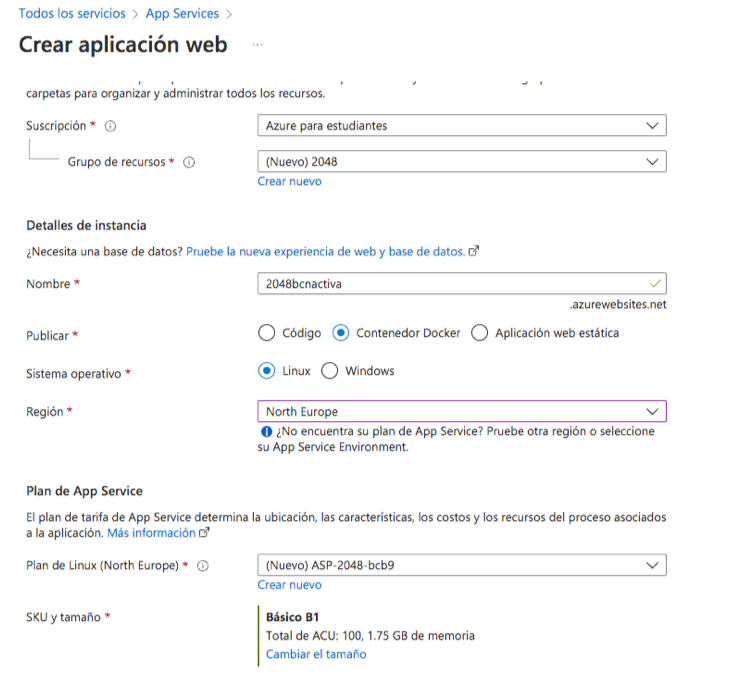
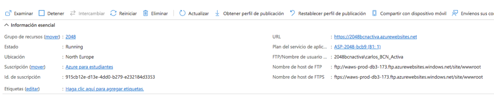

# Tercera sessió

- [Xarxes a Docker](#xarxes-a-docker)
- [Docker Compose](#docker-compose)
- [Docker init](#docker-init)
- [Orquestració](#orquestració)
- [Desplegament](#desplegament)
  
## Xarxes a Docker

Una de les coses que cal tenir en compte quan despleguem una aplicació amb Docker, és com es comuniquen els contenidors entre ells. Per defecte, Docker crea una xarxa per defecte anomenada `bridge` i tots els contenidors que es creen, es connecten a aquesta xarxa. A més els contenidors s'identifiquen per nom com si tinguessim un servei de DNS.

Aquesta xarxa és una xarxa privada i els contenidors que s'hi connecten, poden comunicar-se entre ells. Aquesta xarxa també permet que els contenidors es puguin comunicar amb l'exterior, però només si s'han mapejat els ports amb la comanda `docker run -p`.

Si volem crear una xarxa pròpia per comunicar una sèrie de contenidors, caldrà crear una xarxa amb la comanda `docker network create`. Per exemple:

```bash
docker network create --driver bridge mynetwork
```

Existeixen cinc tipus de xarxes: `bridge`, `host`, `macvlan`, `ipvlan`, `overlay` i `none`:

- La xarxa `bridge` és la que hem vist abans i es comporta com la xarxa NAT dels virtualitzadors.
- La xarxa `host` fa que el contenidor comparteixi la xarxa amb el host, sense cap aïllament, és a dir, el contenidor es comporta com si fos una aplicació més del host. Aquest mode només funciona amb Linux.
- La xarxa `macvlan` fa que el contenidor tingui una adreça MAC pròpia i es comporti com un dispositiu físic. Aquest mode de xarxa és molt útil per a aplicacions que necessiten una adreça MAC pròpia, per exemple aplicacions que fan accés directe a la xarxa (habitualment codi antic). Aquest mode també funciona únicament amb Linux.
- Xarxa 'ipvlan' fa que el contenidor tingui una adreça IP pròpia i es comporti com un dispositiu físic. Aquest mode de xarxa és molt útil per a aplicacions que necessiten una adreça IP pròpia, com per exemple, aplicacions que necessiten multicast. Aquest tipus de xarxa funcinoa amb Linux i amb Windows (únicament contenidors Windows).
- La xarxa `overlay` fa que el contenidor es pugui comunicar amb altres contenidors que estiguin en altres hosts. És la xarxa que s'utilitza en orquestradors de contenidors com Docker Swarm o Kubernetes.
- La xarxa `none` fa que el contenidor no tingui cap tipus de xarxa.

Quan hi treballem amb Docker Desktop el més habitual és que sempre hi fem servir xarxes de tipus `bridge`.

Podem inspeccionar les xarxes que tenim amb la comanda `docker network ls` i veure els detalls d'una xarxa amb la comanda `docker network inspect`.

Quan es crea un contenidor, es pot associar a una xarxa determinada, sinó, es connectarà a la xarxa per defecte `bridge`. Per exemple:

```bash
docker run -d --name webapp --network mynetwork webapp:1.0
```

## Docker compose

Docker Compose és una eina que permet gestionar contenidors de forma declarativa. Això vol dir, que en comptes de crear contenidors amb comandes, els creem amb fitxers de configuració. Això ens permet tenir un control més gran sobre els contenidors i també ens permet gestionar-los de forma més senzilla. A més, ens permetrà crear entorns amb més d'un contenidor, per exemple, un contenidor amb el servidor web i un altre amb la base de dades.

Per crear un entorn de Docker Compose, haurem d'utilitzar un fitxer de configuració anomenat `docker-compose.yml` o `compose.yml`. Aquest arxiu definirà els diversos contenidors implicats, així com altres aspectes com són les xarxes, els volums, les variables d'entorn, etc.

Les principas comandes de docker compose són les següents:

- `docker compose up`: crea i aixeca els serveis que es troben a l'arxiu `docker-compose.yaml`.
- `docker compose down`: atura i elimina els serveis que es troben a l'arxiu `docker-compose.yaml`.
- `docker compose build`: construeix els serveis que es troben a l'arxiu `docker-compose.yaml`.
- `docker compose push`: envia les imatges dels serveis que es troben a l'arxiu `docker-compose.yaml` a un registre de Docker Hub o a un altre registre.
- `docker compose pull`: descarrega les imatges dels serveis que es troben a l'arxiu `docker-compose.yaml` d'un registre de Docker Hub o d'un altre registre.
- `docker compose run`: executa una comanda en un servei que es troba a l'arxiu `docker-compose.yaml`.
- `docker compose ps`: mostra l'estat dels serveis que es troben a l'arxiu `docker-compose.yaml`.
- `docker compose logs`: mostra els logs dels serveis que es troben a l'arxiu `docker-compose.yaml`.
- `docker compose exec`: executa una comanda en un contenidor que es troba a l'arxiu `docker-compose.yaml`.
- `docker compose restart`: reinicia els serveis que es troben a l'arxiu `docker-compose.yaml`.

En aquest [link](https://devhints.io/docker-compose) trobareu una guia de les comandes de Docker Compose.

A més, podem fer comandes com `docker compose up --build -d` per aixecar els serveis en mode detachat i construir-los si la imatge no existeix o s'ha d'actualtizar amb canvis.

### Creant un entorn amb Docker Compose

docker-compose.yml

```yaml
version: "3.9"
services:
  webserver:
    image: nginx
    ports:
      - "8080:80"
    volumes:
      - type: bind
      source: ./web
      target: /usr/share/nginx/html
      read_only: true
```

En aquest arxiu estem definint un contenidor anomenat `webserver` que utilitza la imatge `nginx` i que mapeja el port 80 del contenidor al port 8080 de l'equip host. A més, estem creant un volum que es mapeja  la carpeta `web` de l'equip host a la carpeta `/usr/share/nginx/html` del contenidor. és de només lectura, és a dir, que des del contenidor no es pot modificar el contingut.

Per arrancar l'entorn, només cal que executem la comanda `docker compose up`:

```powershell
docker compose up -d
```

Si executem la comanda `docker ps`, veurem que tenim un contenidor en execució.

```powershell
docker ps --format "table {{.Ports}}\t{{.Names}}"
```

El resultat serà:

```powershell
PORTS                  NAMES
0.0.0.0:8080->80/tcp   09dockercompose_nginx_webserver_1
```

Si volem aturar l'entorn, només cal que executem la comanda `docker-compose down`:

```powershell
docker compose down
```

Un segon exemple, és veure com podem simplificar la creació d'un contenidor amb una SQL server. Gràcies al composer, podem escriure de forma molt més senzilla les variables de configuració:

```yaml
version: '3.9'

networks:
  app-network-public:
    driver: bridge

volumes:
  sql-data
services:
  db:
    image: mcr.microsoft.com/mssql/server
    container_name: db-sqlserver
    networks:
      - app-network-public
    restart: always
    env_file:
      - sqlserver.env
      - sapassword.env
    ports:
      - '1433:1433'
    volumes:
      - sql--data:/opt/mssql/
```

Quan aturem el contenidor, les dades es mantenen en els volums que hem creat. Si volem eliminar també els volums:

```powershell
docker compose down -v
```

Un altre exemple més complex, amb un contenidor amb el servidor web i un altre amb la base de dades:
docker-compose.yml

```yaml
version: "3.9"
services:

  wordpress:
    image: wordpress
    restart: always
    ports:
      - 8080:80
    environment:
      WORDPRESS_DB_HOST: db
      WORDPRESS_DB_USER: exampleuser
      WORDPRESS_DB_PASSWORD: examplepass
      WORDPRESS_DB_NAME: exampledb
    volumes:
      - wordpress:/var/www/html

  db:
    image: mysql:5.7
    restart: always
    environment:
      MYSQL_DATABASE: exampledb
      MYSQL_USER: exampleuser
      MYSQL_PASSWORD: examplepass
      MYSQL_RANDOM_ROOT_PASSWORD: '1'
    volumes:
      - db:/var/lib/mysql

volumes:
  wordpress:
  db:
```

En aquest cas tenim un entorn per desplegar un WordPress, tenim dos serveis (contenidors), un amb el servidor web i un altre amb la base de dades. A més, tenim dos volums, un per la base de dades i un altre per les dades del WordPress. El servei de WordPress mapeja el port per ser accessible des de l'equip host i el servei de la base de dades no, perquè només es pot accedir des del servei de WordPress. Cal indicar, que tots dos contenidors, comparteixen la mateixa xarxa, per tant, es poden comunicar entre ells.

## Docker init

Una de les darreres novetats de Docker és la comanda `docker init`. Aquesta comanda ens permet empaquetar una aplicació dins una imatge de forma senzilla. Aquesta comanda automatitza la creació d'actius essencials relacionats amb Docker, com `Dockerfile`, `.dockerignore` i `compose.yaml`.

El funcionament és força senzill. Només cal executar la comanda `docker init` dins la carpeta on tinguem el nostre projecte i seguir les instruccions que ens donarà la comanda.

```bash
Welcome to the Docker Init CLI!

This utility will walk you through creating the following files with sensible defaults for your project:
  - .dockerignore
  - Dockerfile
  - compose.yaml
  - README.Docker.md

Let's get started!

? What application platform does your project use?  [Use arrows to move, type to filter]
> PHP with Apache - (detected) suitable for a PHP web application
  Go - suitable for a Go server application
  Python - suitable for a Python server application
  Node - suitable for a Node server application
  Rust - suitable for a Rust server application
  ASP.NET Core - suitable for an ASP.NET Core application
  Java - suitable for a Java application that uses Maven and packages as an uber jar
  Other - general purpose starting point for containerizing your application
  Don''t see something you need? Let us know!
  Quit
```

Ens proposa l'aplicació que creu que és, però en qualsevol cas, només caldrà seleccionar el tipus d'aplicació que volem empaquetar i la comanda `docker init` ens crearà tots els fitxers necessaris per empaquetar l'aplicació en una imatge de Docker.

Per aixecar el contenidor, només caldrà executar la comanda `docker compose`:

```bash
docker compose build -d
```

## Orquestració

El següent pas és aplicar els contenidors amb la filosofia dels microserveis, això implica:

- Escalar els diferents serveis de forma independent.
- Gestionar el conjunt de contenidors de manera que funcioni de la forma més autònoma possible.

Dockers Swarm i Kubernetes (eina desenvolupada per Google) són les dues opcions més habituals per aquesta tasca. Tot i que en els darrers anys, Kubernetes s'ha convertit en l'estàndard de facto per aquesta tasca, tot i això, Docker Swarm és una opció més senzilla i més fàcil d'implementar.

## Desplegament

Un cop tenim les nostres aplicacions empaquetades en contenidors, el següent pas és desplegar-les. Això es pot fer de dues maneres:

- Desplegament local o on-premises. Necessitem un servidor que disposi de Docker Engine instal·lat.

- Desplegament a serveis de cloud. Molts serveis de cloud disposen de serveis de contenidors que ens permeten desplegar les nostres aplicacions de forma senzilla.



### Desplegament on-premises

Els contenidors de Docker es poden desplegar fàcilment a un servidor dedicat. Per posar en funcionament Docker al servidor cal seguir les següents passes:

- Instal·lar el motor Docker (Docker Engine).
- Disposar de les imatges necessàries (pròpies i les genèriques).
- Utilitzar les imatges per activar contenidors.
- Configurar xarxa, volums.
- Configurar el tallafocs per permetre l'accés als ports necessaris.

Si voleu simplificar encara més el procés de desplegament, podeu utilitzar Docker Compose, de la mateixa manera que s'ha fet a l'entorn local de desenvolupament.

Si la solució es prou complexa una bona alternativa pot ser utilitzar Docker Swarm, que és una eina que permet gestionar un clúster de contenidors de Docker. Aquesta eina permet gestionar els contenidors de forma més senzilla i també permet gestionar-los de forma més autònoma.

### Desplegament al cloud

Podem desplegar les nostres imatges directament a serveis com:

- Heroku
- AWS
- Google Cloud
- Azure

Aquests desplegaments es poden fer de tres formes diferents:

**IaaSS**: Infraestructura com a servei, on despleguem les nostres màquines virtuals i després despleguem les nostres imatges de Docker. D'aquesta manera es realitza una gestió similar a si ho fem a un servidor dedicat, però amb la flexibilitat que ens dona el cloud: escalat, manteniment, etc.

**PaaS**: Plataforma com a servei, on ens oblidem de les configuracions de la màquina virtual de base i directament despleguem les nostres imatges.

Exemple de desplegament PaaS a Azure com alternativa a desplegar codi en una aplicació web:

En el primer pas seleccionem el servei App Service per desplegar l'aplicació, indicant que desplegarem a partir d'una imatge de Docker:



Al segon pas, indiquem quina serà la imatge a usar:


Un cop configurat, l'aplicació es desplegarà i estarà disponible a la URL que ens indica el servei:




**CaaS**: aquest tercer model (Container as a Service) incorpora una capa d'abstracció més, que proporciona específicament una plataforma per executar i gestionar aplicacions containeritzades. Està dissenyat per facilitar la seva gestió, gestió i escala de contenidors i microserveis al núvol. En aquest model, Kubernetes és l'eina més utilitzada, tot i que també hi ha opcions per desplegar contenidors de forma individual com Azure Container Instances o AWS Fargate.

[Tornar a l'índex](README.md)
